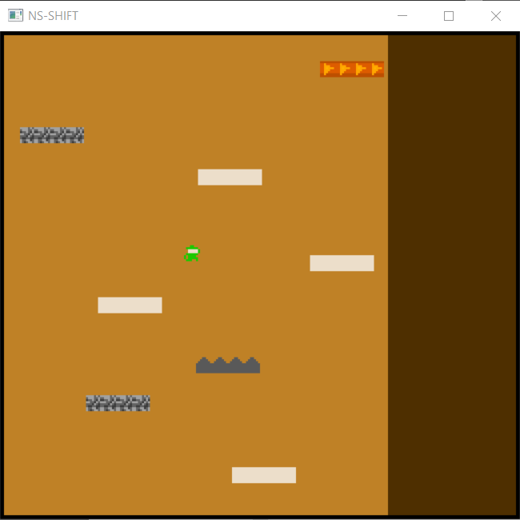

# (NS-SHIFT)

Author: Yue Wang

Design: There are different types of blocks in the game. You can also see your score and hp in command.

Screen Shot:

How Your Asset Pipeline Works:

**STEP 1: Draw png files and put them in the project**
In my game, there are 2 types of background and 5 types of sprites. I drew them in PS and export as png file. their size are all 8x8 pixel and the color are all less than 4. I put these pngs in a new folder named "data" in the project folder.

**STEP2: Load png**
I create a function named "create_tile_palette_table" which include load png, create palette table and tile table. Use load_png(std::string filename, glm::uvec2 &data_size, std::vector<glm::u8vec4> &png_data, OriginLocation origin) to load the png.

STEP3: Create a palette table
First create a vector named "temp_palette_table" as a template to store the palette table information. Add the color of the first pixel in the png_data to temp_palette_table as the first color. Use std::count(temp_palette_table.begin(), temp_palette_table.end(), png_data.at(i)) to check if current color is in the temp_palette_table. If count return false, that means the current color is not in the temp_palette_table, so we can add this color into temp_palette_table. After check all the pixel on the png_data, we get a temp_palette_table with 4 different color (or less). Use std::copy(temp_palette_table.begin(), temp_palette_table.end(), ppu.palette_table[palette_index].begin()) to copy the template palette table to ppu palettle table.

**STEP4: Create a tile table**
Iterate the png_data again, record the location of each pixel base on color. Tiletable is an 8x8 matrix composed of bit0 and bit1. Bit0 decides ones place, bit1 decides tens place. These two decide each tile in the tile_table use which color to draw. So if the color on png_data match with the color in palette table, set this tile's bit0 and bit1, make it match the index of the color in the palette table. After iterate the whole png_data, the tile_table complete.

**STEP5 Draw**
Use ppu.background[x + PPU466::BackgroundWidth * y] = 0b0000000000000000 to draw background, use ppu.background_position to decide the background position.
Use ppu.sprites to draw sprites.

see my fancy character: [link](data/)

How To Play:

Move: Left/Right key

Try to get high score in the game!

This game was built with [NEST](NEST.md).

